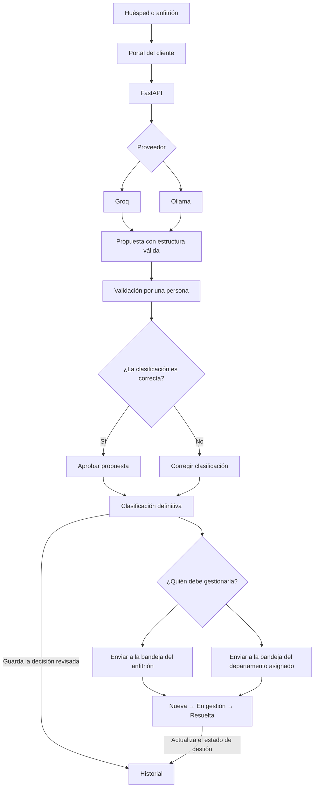

# PRIO

**Right request. Right priority. Right destination.**


PRIO es un prototipo individual de AI Engineering que clasifica, prioriza y
deriva solicitudes de soporte de huéspedes y anfitriones de una plataforma de
alojamientos. Combina modelos de lenguaje, validación estructurada, revisión
manual y seguimiento operativo.

> Proyecto académico independiente. No es una integración oficial con Airbnb
> ni con otra plataforma de alojamientos.

## Problema

Las solicitudes de acceso, reservas, pagos, alojamiento o seguridad pueden
llegar al mismo canal y con niveles de urgencia muy diferentes. Si se atienden
solo por orden de llegada, una emergencia podría quedar detrás de una consulta
informativa.

PRIO transforma cada mensaje en una propuesta estructurada para que una persona
pueda validarla antes de enviarla a su destino.

## Funcionalidades

- Portal independiente para huéspedes y anfitriones.
- Clasificación mediante Groq o un modelo local servido por Ollama.
- Modo automático: intenta Groq y utiliza Ollama como respaldo si el proveedor
  externo falla.
- Salida JSON validada con Pydantic.
- Categoría, prioridad, responsable, departamento, resumen y justificación.
- Revisión manual para aprobar o corregir la propuesta del modelo.
- Historial que conserva la propuesta original y la decisión definitiva.
- Derivación interna a la bandeja del anfitrión o al departamento adecuado.
- Seguimiento del estado: `Nueva`, `En gestión` y `Resuelta`.
- Comparación de calidad, latencia, tokens y coste estimado de los modelos.
- Comparación en directo de una misma solicitud con Groq y Ollama sin guardar
  registros de demostración.
- Reintentos con espera progresiva ante límites de uso o fallos temporales.
- Pruebas automáticas y flujo de integración continua con GitHub Actions.

## Flujo completo



## Interfaces

PRIO separa la experiencia del cliente del panel de administración:

- **Portal del cliente:** permite indicar si escribe un huésped o anfitrión y
  enviar el aviso. La persona recibe una confirmación adaptada a la urgencia,
  sin ver la clasificación interna ni el número de solicitud.
- **Panel interno:** contiene Inicio, Revisión, Bandejas, Historial, Métricas y
  Configuración.

## Clasificación y derivación

| Categoría | Destino habitual |
| --- | --- |
| Acceso | Anfitrión; Soporte de reservas si debe intervenir la plataforma |
| Reservas | Soporte de reservas |
| Pagos | Pagos y facturación |
| Alojamiento | Soporte del alojamiento |
| Comportamiento de huéspedes | Confianza y seguridad |
| Seguridad | Confianza y seguridad |
| Información general | Atención general o anfitrión, según la petición |

Las clasificaciones son propuestas. Una persona debe aprobarlas o corregirlas
antes de que PRIO cree la derivación interna.

## Proveedores de IA

| Modo | Comportamiento |
| --- | --- |
| Automático | Prueba Groq y cambia a Ollama si se produce un error de conexión o validación |
| Groq | Utiliza únicamente el proveedor externo |
| Ollama | Utiliza únicamente el modelo local |

La configuración seleccionada se mantiene mientras FastAPI está activo y
vuelve a `Automático` al reiniciar el servidor.

Modelos utilizados durante el desarrollo:

- Ollama: `llama3.2:3b`.
- Groq: `openai/gpt-oss-20b`.

## Evaluación

Los dos proveedores se evaluaron con los mismos 10 casos, separados de los
ejemplos incluidos en el prompt.

| Proveedor | Clasificación correcta | Tiempo total | Coste registrado |
| --- | ---: | ---: | ---: |
| Ollama | 10/10 | 164,27 s | $0,00000000 |
| Groq | 10/10 | 11,22 s | $0,00000000 |

El coste mostrado corresponde a la configuración y capa gratuita usadas en la
evaluación; no implica que todas las ejecuciones futuras sean gratuitas.

## Stack técnico

| Tecnología | Uso en PRIO |
| --- | --- |
| Python 3.12 | Lenguaje principal del proyecto |
| FastAPI y Uvicorn | API y servidor del backend |
| Pydantic y pydantic-settings | Validación estructurada y configuración |
| Streamlit | Portal del cliente y panel interno |
| SQLite | Persistencia de solicitudes, revisiones y derivaciones |
| HTTPX | Comunicación entre servicios y proveedores |
| Ollama | Ejecución del modelo local |
| Groq | Ejecución rápida del modelo externo |
| Pytest | Pruebas automáticas |
| GitHub Actions | Ejecución de las pruebas en GitHub |

## Instalación local

### 1. Clonar el repositorio

```bash
git clone https://github.com/Gema-Villanueva/PRIO.git
cd PRIO
```

### 2. Crear y activar el entorno virtual

En Windows con Git Bash:

```bash
python -m venv .venv
source .venv/Scripts/activate
```

### 3. Instalar dependencias

Para ejecutar la aplicación:

```bash
python -m pip install -r requirements.txt
```

Para desarrollar y ejecutar las pruebas:

```bash
python -m pip install -r requirements-dev.txt
```

### 4. Configurar las variables de entorno

```bash
cp .env.example .env
```

Completar en `.env`:

```dotenv
EXTERNAL_API_KEY=tu_clave_de_groq
```

El archivo `.env` está excluido de Git. Nunca debe subirse una clave real al
repositorio.

### 5. Preparar Ollama

Con Ollama instalado y funcionando:

```bash
ollama pull llama3.2:3b
```

## Ejecución

La aplicación utiliza tres procesos. Deben ejecutarse desde la raíz del
repositorio y con el entorno virtual activado.

### Terminal 1: API

```bash
python -m uvicorn backend.main:app --reload
```

API: `http://localhost:8000`

### Terminal 2: portal del cliente

```bash
python -m streamlit run frontend/customer_app.py
```

Portal: `http://localhost:8501`

### Terminal 3: panel interno

```bash
python -m streamlit run frontend/app.py --server.port 8502
```

Panel: `http://localhost:8502`

## Rutas principales de la API

| Método | Ruta | Uso |
| --- | --- | --- |
| GET | `/health` | Comprobar el estado de FastAPI |
| POST | `/triage/` | Clasificar y guardar una solicitud |
| POST | `/triage/compare` | Comparar Groq y Ollama sin guardar la solicitud |
| GET/PUT | `/triage/provider` | Consultar o cambiar el modo del proveedor |
| GET | `/reviews/pending` | Consultar propuestas pendientes |
| POST | `/reviews/{id}/approve` | Aprobar una clasificación |
| PUT | `/reviews/{id}/correct` | Corregir una clasificación |
| GET | `/reviews/completed` | Consultar el historial |
| GET | `/reviews/dispatches` | Consultar las bandejas internas |
| PUT | `/reviews/dispatches/{id}/status` | Actualizar el estado de gestión |

FastAPI también ofrece documentación interactiva en
`http://localhost:8000/docs`.

## Pruebas

```bash
python -m pytest -q
```

El proyecto cuenta actualmente con 37 pruebas sobre esquemas, proveedores,
reintentos, triaje, persistencia, revisión, historial y derivaciones.

GitHub Actions repite las pruebas automáticamente en cada cambio enviado a
`main` y en las pull requests dirigidas a esa rama.

## Ejecutar la evaluación

Evaluación local con Ollama:

```bash
python evaluations/run_evaluation.py --provider ollama
```

Evaluación externa con Groq:

```bash
python evaluations/run_evaluation.py --provider groq
```

## Estructura principal

```text
PRIO/
├── backend/
│   ├── db/                    # Persistencia SQLite
│   ├── integrations/          # Clientes de Ollama y Groq
│   ├── modules/triage/        # Clasificación y selección de proveedor
│   ├── modules/review/        # Revisión, historial y derivación
│   └── prompts/               # Instrucciones y ejemplos del modelo
├── data/                      # Casos de demostración y evaluación
├── evaluations/               # Ejecutor de evaluación comparativa
├── frontend/
│   ├── customer_app.py        # Portal del cliente
│   ├── app.py                 # Panel interno
│   └── pages/                 # Revisión, Bandejas, Historial, Métricas y Configuración
├── tests/                     # Pruebas automáticas
├── .streamlit/config.toml     # Tema visual compartido
└── .github/workflows/ci.yml   # Integración continua
```

## Sesgos, privacidad y limitaciones

### Posibles sesgos

- Un modelo puede dar más urgencia a un mensaje escrito con palabras intensas
  aunque los hechos no indiquen un peligro mayor.
- Los mensajes con faltas de ortografía, expresiones locales, poco contexto o
  descripciones ambiguas pueden clasificarse peor.
- El modelo podría confundir a la persona que escribe con otras personas
  mencionadas en el mensaje.
- Las categorías disponibles reflejan el diseño de este prototipo y podrían no
  representar todos los problemas de una plataforma real.
- La evaluación contiene 10 casos controlados. El resultado 10/10 no demuestra
  un funcionamiento perfecto ante cualquier solicitud real.

### Medidas para reducir los riesgos

- La prioridad debe basarse en los hechos descritos y no en género, origen,
  raza, barrio inferido u otras características demográficas.
- `user_role` identifica de forma explícita si escribe un huésped o anfitrión;
  el modelo no debe inferir ni cambiar esa identidad.
- Pydantic rechaza respuestas que incumplen el esquema, los valores permitidos
  o las reglas de asignación de departamentos.
- El prompt incluye reglas para preservar negaciones y no inventar hechos.
- Cada clasificación requiere aprobación o corrección antes de la derivación.
- El Historial conserva la propuesta original y la decisión definitiva para
  facilitar su revisión posterior.
- Ollama y Groq se comparan utilizando los mismos casos de evaluación.

### Privacidad

- Los mensajes de demostración no deben incluir contraseñas, datos bancarios,
  documentación personal ni otra información sensible.
- La clave de Groq se guarda en `.env`, archivo excluido del repositorio.
- La petición externa utiliza `store: false` para solicitar que el proveedor no
  almacene la respuesta mediante esa opción de la API.
- El panel interno todavía no incorpora autenticación, por lo que debe
  utilizarse únicamente en un entorno local o de demostración controlado.

### Limitaciones técnicas

- La derivación utiliza bandejas internas. PRIO no envía todavía correos,
  notificaciones móviles ni tickets a servicios externos.
- El cambio a `Resuelta` es manual: PRIO no puede comprobar por sí solo que el
  departamento o anfitrión haya solucionado el problema.
- SQLite es adecuado para esta demostración local, pero una implantación con
  varios usuarios debería utilizar una base de datos compartida como PostgreSQL.
- La configuración del proveedor vuelve al modo automático al reiniciar
  FastAPI.
- Ollama se ejecuta localmente. Un despliegue en Internet necesitaría alojar el
  modelo en otro servidor o utilizar Groq como proveedor de producción.
- La aplicación no está desplegada y requiere tres procesos locales activos:
  FastAPI, el portal del cliente y el panel interno.

## Posibles mejoras

- Autenticación y permisos por departamento.
- Integración con correo, notificaciones móviles, Zendesk, Jira o Slack.
- Sustitución de SQLite por PostgreSQL.
- Entrada por voz desde el portal del cliente.
- Persistencia de la configuración del proveedor.
- Despliegue del portal, panel, API y base de datos.

## Autora

Proyecto individual desarrollado por Gema Villanueva.
