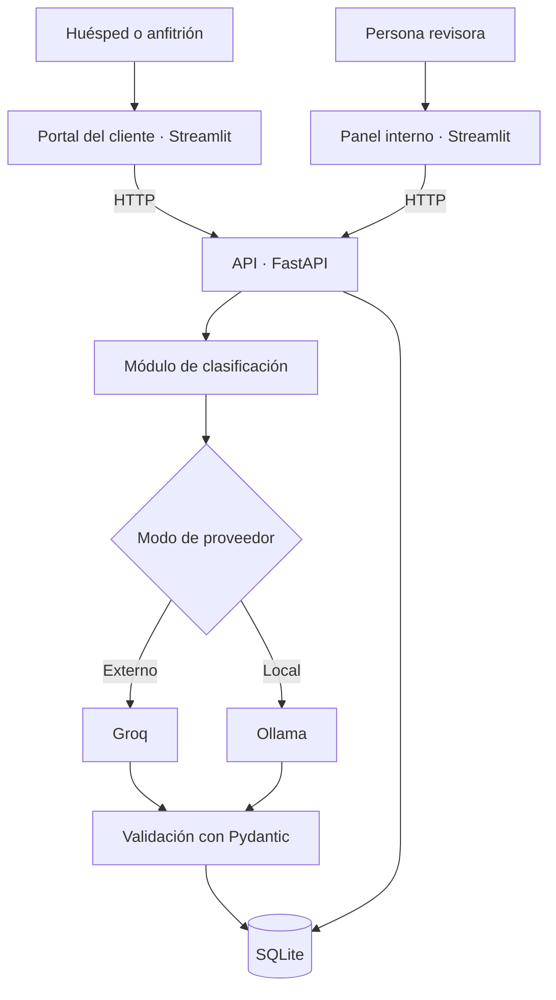
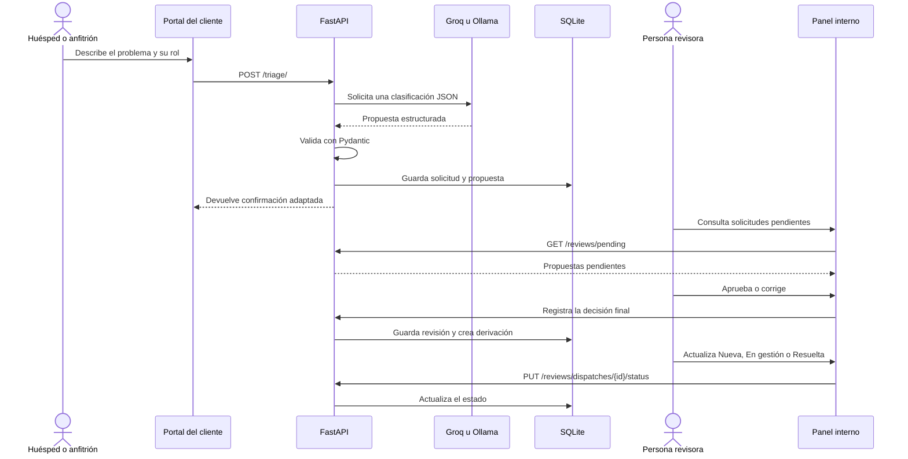

# Arquitectura de PRIO

PRIO es un prototipo local formado por tres procesos independientes que se
comunican mediante HTTP:

| Componente | Tecnología | Puerto | Responsabilidad |
| --- | --- | ---: | --- |
| Portal del cliente | Streamlit | 8501 | Recoger solicitudes de huéspedes y anfitriones |
| Panel interno | Streamlit | 8502 | Revisar, derivar y consultar solicitudes |
| API | FastAPI | 8000 | Aplicar las reglas de negocio y acceder a los datos |

SQLite conserva las solicitudes, las revisiones y las derivaciones. Groq y
Ollama se encuentran detrás de la API, por lo que las interfaces no llaman a
los modelos directamente.

## Vista general

## Flujo de una solicitud

## Responsabilidades por capa

### Interfaces

- `frontend/customer_app.py` presenta el formulario público y una confirmación
  sin información interna.
- `frontend/app.py` y `frontend/pages/` forman el panel de revisión, bandejas,
  historial, métricas y configuración.
- `frontend/api_client.py` concentra las llamadas HTTP a FastAPI.

### API y dominio

- `backend/main.py` configura la aplicación e inicializa la base de datos.
- `backend/modules/triage/` selecciona el proveedor, ejecuta la clasificación y
  valida la respuesta.
- `backend/modules/review/` gestiona aprobación, corrección, historial y
  derivación.
- `backend/integrations/` contiene los clientes de Groq y Ollama.
- `backend/prompts/` contiene las instrucciones y ejemplos enviados al modelo.

### Persistencia

SQLite utiliza dos entidades principales:

- `triage_requests`: mensaje original, rol, propuesta del modelo, métricas y
  decisión revisada.
- `dispatches`: solicitud asociada, tipo de derivación, destino, mensaje,
  estado y fecha de creación.

Una solicitud genera como máximo una derivación después de aprobarse o
corregirse. La derivación puede ser una notificación al anfitrión o una
asignación a un departamento de la plataforma.

## Selección de proveedor

| Modo | Ejecución |
| --- | --- |
| Automático | Intenta Groq y utiliza Ollama si falla la conexión o la validación |
| Groq | Solo utiliza el proveedor externo |
| Ollama | Solo utiliza el modelo local |

La respuesta de ambos proveedores debe cumplir el mismo esquema Pydantic. Esto
permite cambiar de modelo sin modificar el resto de la aplicación.

## Límites de esta arquitectura

La arquitectura está pensada para una demostración local. SQLite, la ausencia
de autenticación y las bandejas internas no son suficientes para un entorno de
producción con varios departamentos. Una evolución natural sería incorporar
PostgreSQL, autenticación con permisos, trabajos en segundo plano e
integraciones con un sistema real de tickets o notificaciones.
